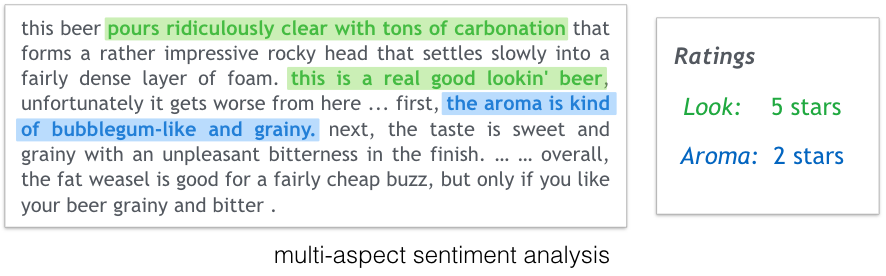
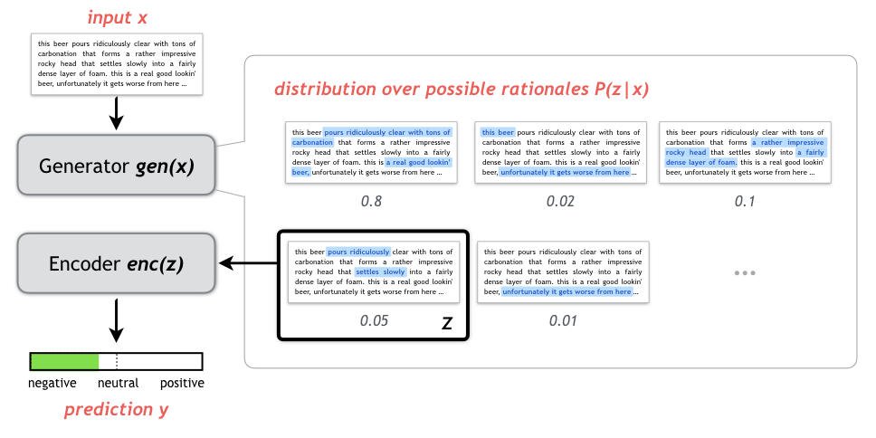

### Latest updates
Check [code/rationale](/code/rationale) for the project of learning rationales for neural prediction:  

 &nbsp; &nbsp; &nbsp; &nbsp; 

-------

#### About this repo
This repo contains Theano implementations of popular neural network components and optimization methods. Source code of the following papers are also available:

  [1] [Molding CNNs for text: non-linear, non-consecutive convolutions](http://arxiv.org/abs/1508.04112). EMNLP 2015
  
  [2] [Semi-supervised Question Retrieval with Gated Convolutions](http://arxiv.org/abs/1512.05726). NAACL 2016

  [3] [Rationalizing Neural Predictions](https://people.csail.mit.edu/taolei/papers/emnlp16_rationale.pdf). EMNLP 2016

#### Features
  - Basic modules including feedforward layer, dropout, word embedding, RNN, LSTM, GRU and CNN
  - Optimization methods including SGD, AdaGrad, AdaDelta and Adam
  - Advanced modules from recent papers such as attention and gated convolution.
  - Transparent to use GPU

-------

#### Projects

###### 1. Neural question retrieval for community-based QA

The directories [code/qa](/code/qa) and [code/pt](/code/pt) contain the implementation of the model described in paper [[2]](http://arxiv.org/abs/1512.05726). Datasets and and pre-trained word vectors are available at [here](https://github.com/taolei87/askubuntu).

###### 2. Sentiment analysis / document classification

The directory [code/sentiment](/code/sentiment) contains the implementation of the model described in paper [[1]](http://arxiv.org/abs/1508.04112). Datasets and and pre-trained word vectors are available at [here](https://github.com/taolei87/text_convnet).

###### 3. Rationalizing neural predictions

The directory [code/rationale](/code/rationale) contains the implementation of the model described in paper [[3]](https://people.csail.mit.edu/taolei/papers/emnlp16_rationale.pdf).

-------

#### Dependencies
  [Theano](http://deeplearning.net/software/theano/) >= 0.7, Python >= 2.7, Numpy

-------
