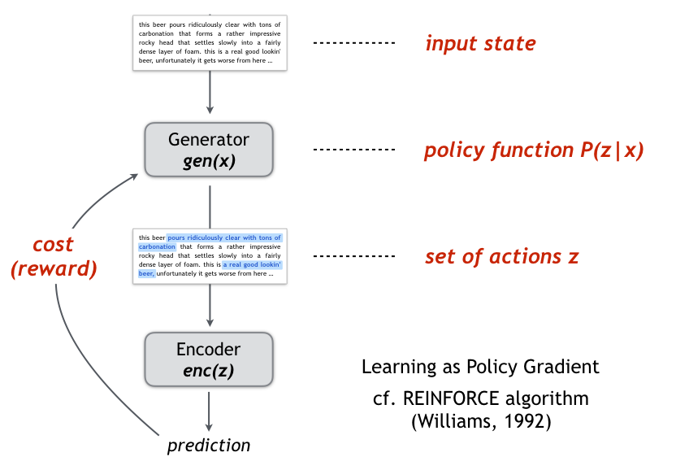

## Learning Rationales behind Predictions

### About
This directory contains the code and resources of the following paper:

<i>"Rationalizing Neural Predictions". Tao Lei, Regina Barzilay and Tommi Jaakkola. EMNLP 2016.  [[PDF]](https://people.csail.mit.edu/taolei/papers/emnlp16_rationale.pdf)  [[Slides]](https://people.csail.mit.edu/taolei/papers/emnlp16_rationale_slides.pdf)</i>

The method learns to provide justifications, i.e. rationales, as supporting evidence of neural networks' prediction. The following figure illustrates the rationales and the associated predictions for multi-aspect sentiment analysis on product reivew:

### Overview of the Model
We optimize two modular (neural) components, generator and encoder, to produce rationales and predictions. The framework is generic -- generator and encoder can be implemented and realized in various ways such as using RNNs or CNNs. We train the model in a RL style using policy gradient (specifically REINFORCE), as illustrated below.

    

### Sub-directories
  - this root directory contains impelmentation of the rationale model used for the beer review data. ``rationale.py`` implements the independent selection version and ``rationale_dependent.py`` implements the sequential selection version. See the paper for details.
  - [example_rationales](example_rationales) contains rationales generated for the beer review data. 
  - [ubuntu](ubuntu) contains alternative implementation for the AskUbuntu data.
  - [medical](medical) contains alternative implementation for medical report classification. 

### Data
  - **Proudct reviews:** We provide subsets of reviews and pre-trained word embeddings at [here](http://people.csail.mit.edu/taolei/beer/). This should be sufficient for producing our results. Please contact the author of the dataset, [Prof. McAuley](http://cseweb.ucsd.edu/~jmcauley/) for the full set (1.5 million reviews).   
  - **AskUbuntu data:** AskUbuntu question data is available in [this repo](https://github.com/taolei87/askubuntu).
  - **Pathology data:** This data is not available due to patients' privacy. We only provide the code and example snapshot at [/medical directory](medical)
  
**Important Note:** all data is for research-purpose only.

### To-do
  - [ ] documentation of the code
  - [ ] example usage of the code
  - [ ] put trained models in the repo??
