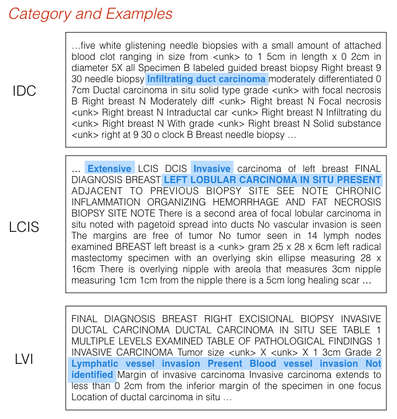

#### Parsing Medical Report

Example code used for binary classification on medical (pathology) report data. Simple one-layer CNNs are used as the generator and encoder module. 

The model produces rationales that indicate whether a specific class (e.g. disease or symptom) is present in the document.

